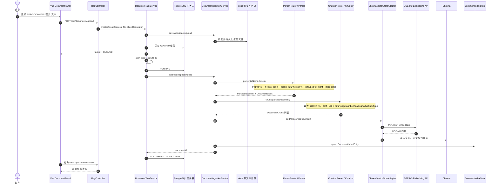
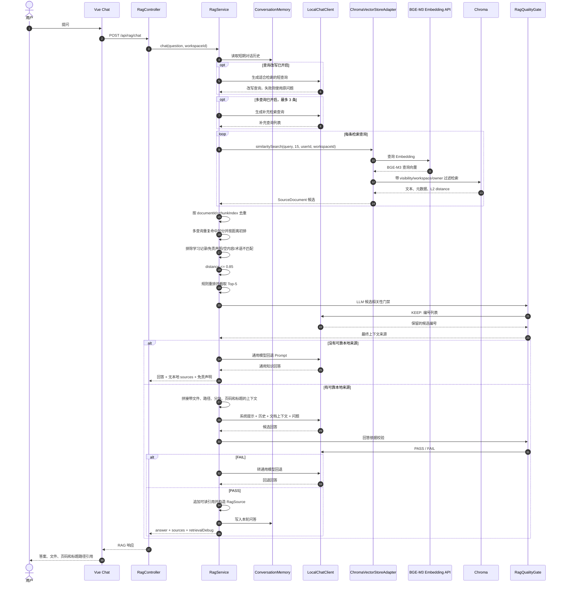
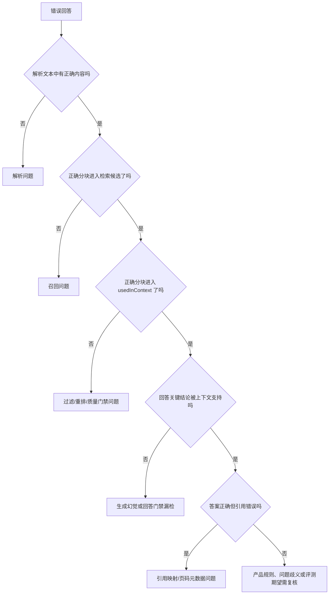

# RAG 系统设计

## 1. 文档目的

本文描述当前知识助手已经落地的 RAG 链路，而不是未来规划。目标是让开发、排障和评测人员能够：

1. 在 10 分钟内讲清楚文档从上传到回答的完整过程。
2. 将错误回答归因到解析、召回、重排/上下文或生成阶段。
3. 明确当前 Chroma 分数是距离而不是相似度，并正确解释阈值。

本文对应的核心实现：

- `DocumentTaskService`：上传任务、后台执行、重试和阶段进度。
- `DocumentIngestionService`：解析、切片、文档元数据和索引写入。
- `DocumentParserRouter` / `DocumentChunkerRouter`：按文件格式选择解析器和切片器。
- `ChromaVectorStoreAdapter`：Chroma 写入、带空间权限的向量检索、稀疏索引同步和内存回退。
- `PostgresSparseRetriever`：chunk 级 PostgreSQL 全文与精确关键词检索、权限过滤和邻接分块读取。
- `RagService`：查询改写、多查询、Dense/Sparse RRF 融合、过滤、规则重排、上下文和生成。
- `RagQualityGate`：候选相关性筛选和回答依据校验。

## 2. 当前配置快照

| 配置项 | 当前值 | 含义 |
|---|---|---|
| Embedding 模型 | `BAAI/bge-m3` | 通过 OpenAI 兼容接口生成文档和查询向量 |
| 向量库 | Chroma，集合 `knowledge_assistant` | 持久化分块文本、向量和元数据 |
| 稀疏检索 | PostgreSQL `document_chunks` | `tsvector` GIN 索引加应用层精确词、中文二元词片和 OCR 编号变体 |
| 检索融合 | RRF，`k=60` | 每条查询的 Dense/Sparse 排名独立贡献，不混合原始分数尺度 |
| 分数类型 | `distance` | 当前按距离解释 Chroma 返回的 `distance` 元数据 |
| 距离度量 | BGE-M3 归一化向量的 L2 距离 | 数值越小越相关，不是越大越相关 |
| 距离阈值 | `0.85` | 仅保留 `distance <= 0.85` 的候选 |
| 最终 Top-K | `5` | `workbench.rag.top-k` 未显式配置时使用代码默认值 5 |
| 单查询候选数 | `15` | 每条查询先取 `max(topK, topK * 3)`，当前为 15 |
| 查询改写 | 开启 | 使用模型把问题改写成适合检索的短查询；失败时回退原问题 |
| 多查询 | 开启，最多 3 条 | 原查询/改写查询加模型生成的补充查询，合并重复分块 |
| 规则重排 | 开启 | 综合 RRF、向量距离、文件名、标题路径、精确术语、表格类型、正文质量和文档类别排序 |
| LLM 候选门禁 | 开启 | `RagQualityGate.relevantSources` 只保留可直接支持答案的候选 |
| LLM 回答门禁 | 开启 | `RagQualityGate.approvesAnswer` 检查关键结论是否有资料支持 |
| 无本地证据回退 | 开启 | 使用通用模型回答并明确标记不是当前知识库内容，不返回本地引用 |
| Web 搜索 | 关闭 | 当前不会用真实 Web 搜索补充知识 |
| 主生成模型 | `deepseek-ai/DeepSeek-V4-Flash` | OpenAI 兼容 Chat API |
| 备用生成模型 | `Qwen/Qwen2.5-7B-Instruct` | 主模型超时或失败时由 `LocalChatClient` 降级 |
| 切片上限 | 1200 字符 | 各格式切片器当前统一的最大字符数 |
| 切片重叠 | 120 字符 | 长文本相邻分块的上下文重叠 |
| 上下文预算 | 估算 3000 Token | 中文和非中文字符分别估算，按预算选择最终分块 |
| 单文档配额 | 最多 2 个分块 | 避免一个文档占满上下文 |
| 邻接扩展 | 开启 | 只扩展同页且同标题路径的直接相邻分块 |

配置来源：`src/main/resources/application.properties` 与 `RagService` 构造器默认值。

### 2.1 距离与相似度必须这样解释

生产 Chroma 主链路当前返回的是 **L2 距离**：

```text
距离越小，语义越接近。
0.30 比 0.70 更相关。
候选通过条件是 distance <= 0.85。
```

不能把 `0.85` 解释为“相似度至少 85%”。它只是当前模型、向量归一化方式和 Chroma 距离空间下的经验阈值。Embedding 模型、Chroma 集合距离函数或向量归一化策略变化后，必须重新评测阈值并重建索引。

`RagService` 同时支持 `score-direction=similarity`，该模式才使用 `score >= threshold`。当前配置明确为 `distance`。

Chroma 不可用时，`ChromaVectorStoreAdapter` 会把 `InMemoryVectorStore` 的余弦相似度转换为 `1 - similarity`，使回退结果与主链保持“距离越小越好”的协议。内存词频向量仍不等价于 BGE-M3，只作为开发和可用性兜底。

## 3. 核心数据模型

一份文件在链路中的主要形态：

| 形态 | 关键字段 | 用途 |
|---|---|---|
| 上传任务 | `taskId`、`workspaceId`、`sourcePath`、`status`、`stage` | 异步执行、重试、进度和审计 |
| `ParsedDocument` | `documentType`、`content`、`title`、`blocks` | 保存格式解析后的规范化文本和结构块 |
| `DocumentBlock` | `blockType`、`headingPath`、`pageNumber`、offset | 保留页码、标题层级、表格和段落结构 |
| `DocumentChunk` | `content`、`chunkIndex`、结构元数据 | 向量化前的最终检索单元 |
| `SourceDocument` | chunk 内容、文档/空间/权限/结构元数据、score | 向量库写入和检索结果的统一对象 |
| `DocumentChunkEntity` | chunk 正文、文件类型、页码、标题路径、空间、版本和全文生成列 | PostgreSQL 稀疏索引与邻接读取 |
| `DocumentIndexEntry` | `documentId`、路径、哈希、分块数、空间和可见性 | PostgreSQL/本地索引侧的文档目录事实 |
| `RagSource` | 文件、分块、片段、分数、标题路径、页码 | 返回前端的结构化引用 |

文档 ID 规则：工作空间上传使用 `sha256(workspaceId + "\n" + contentHash)` 的前 16 位。二进制文档按原始字节哈希，文本按规范化内容哈希。分块 ID 为：

```text
<documentId>#chunk-<chunkIndex>
```

## 4. 端到端时序图

可直接查看两页横向矢量 PDF：[`RAG_SEQUENCE_DIAGRAMS.pdf`](RAG_SEQUENCE_DIAGRAMS.pdf)。可维护的 Mermaid 源文件位于：

- [`architecture/rag-ingestion-sequence.mmd`](architecture/rag-ingestion-sequence.mmd)
- [`architecture/rag-query-sequence.mmd`](architecture/rag-query-sequence.mmd)

配套学习、复述和自测材料：[`RAG_SEQUENCE_DIAGRAMS_STUDY_GUIDE.md`](RAG_SEQUENCE_DIAGRAMS_STUDY_GUIDE.md)。

### 4.1 上传、解析、切片与向量化



关键一致性规则：配置了 Chroma 时，Chroma 写入失败不能降级成“仅内存写入成功”；任务必须失败或重试，否则应用重启后会出现任务成功但文档不可检索。

### 4.2 检索、重排、生成与引用



## 5. 索引阶段设计

### 5.1 上传与任务调度

| 项目 | 内容 |
|---|---|
| 输入 | 用户、`workspaceId`、文件、`clientRequestId` |
| 输出 | 持久化源文件、`QUEUED` 任务、`taskId` |
| 当前控制 | 文件扩展名、50 MB 上限、写权限、客户端幂等 ID、数据库任务租约和重试 |
| 主要故障 | 不支持格式、文件过大、磁盘不可写、任务重复、线程池拒绝、任务创建者失去权限 |
| 当前信号 | 任务 `status/stage/progress/attempt`；失败日志含 `taskId/type/fileName/failedStage` |
| 建议指标 | `rag_ingest_tasks_total{status,type}`、`rag_ingest_queue_depth`、`rag_ingest_task_duration_seconds`、`rag_ingest_retries_total`、`rag_source_write_failures_total` |

### 5.2 解析

| 项目 | 内容 |
|---|---|
| 输入 | 原始文件名和二进制内容 |
| 输出 | `ParsedDocument`：规范化全文、标题和结构块 |
| 当前行为 | PDF 原生文本优先，扫描/乱码页以 300 DPI OCR；DOCX 保留 Heading 路径；HTML 去脚本、样式、导航和侧栏；图片 OCR |
| 主要故障 | PDF 损坏/加密、OCR 超时或空结果、DOCX 损坏、HTML 非 UTF-8、图片像素超限、乱码文本误判、导航或水印污染正文 |
| 当前信号 | 任务阶段 `PARSING`/`OCR`；异常链；解析器单元测试和多格式评测集 |
| 建议指标 | `rag_parse_duration_seconds{format}`、`rag_parse_failures_total{format,reason}`、`rag_ocr_pages_total`、`rag_ocr_duration_seconds`、`rag_ocr_empty_total`、`rag_parsed_characters` |

### 5.3 切片

| 项目 | 内容 |
|---|---|
| 输入 | `ParsedDocument` 和格式结构块 |
| 输出 | `DocumentChunk` 列表，包含分块正文、offset、页码、标题路径和块类型 |
| 当前行为 | 最大 1200 字符、重叠 120；PDF 不跨页；DOCX 按章节；HTML 保留表格块；Markdown 保留标题层级 |
| 主要故障 | 分块过小导致语义破碎、过大导致召回不准、表头和行分离、页码或标题路径丢失、重叠造成重复上下文、空分块 |
| 当前信号 | 日志 `Document chunking completed chunks/contentLength`；解析器和 Chunker 测试 |
| 建议指标 | `rag_chunks_per_document`、`rag_chunk_characters`、`rag_empty_chunks_total`、`rag_chunk_overlap_ratio`、`rag_chunks_missing_page_total{format=pdf}`、`rag_chunks_missing_heading_total{format=docx}` |

### 5.4 向量化与索引持久化

| 项目 | 内容 |
|---|---|
| 输入 | `SourceDocument` 列表及其文本、空间权限和结构元数据 |
| 输出 | BGE-M3 向量、Chroma 记录、`DocumentIndexEntry` |
| 当前行为 | Chroma 写入成功后再持久化文档索引；元数据包含 `documentId/fileName/chunkIndex/pageNumber/headingPath/workspaceId/visibility` |
| 主要故障 | Embedding API 超时/限流、向量维度变化、Chroma 不可用、部分写入、索引记录与向量不一致、Embedding 模型更换后未重建 |
| 当前信号 | 任务阶段 `VECTORIZING`、`PERSISTING_INDEX`；Chroma 写入失败抛出完整异常；健康接口显示是否配置 Chroma |
| 建议指标 | `rag_embedding_requests_total{status,model}`、`rag_embedding_duration_seconds`、`rag_embedding_tokens_total`、`rag_chroma_write_duration_seconds`、`rag_chroma_write_failures_total`、`rag_index_vector_count_delta` |

## 6. 查询阶段设计

### 6.1 查询理解与扩展

| 项目 | 内容 |
|---|---|
| 输入 | 当前问题和最近最多 4 条历史消息摘要 |
| 输出 | 改写查询和最多 3 条检索查询 |
| 当前行为 | 查询改写、多查询和少量规则词扩展；辅助模型失败时改写回退原问题，多查询空结果时保留已有查询 |
| 主要故障 | 改写丢失专有词、历史污染当前查询、多查询同质化、辅助模型超时增加延迟、规则扩展只覆盖少量已知问题 |
| 当前信号 | `RAG query rewrite completed`、`RAG multi-query generated` 日志；检索诊断返回实际 queries |
| 建议指标 | `rag_query_rewrite_duration_seconds`、`rag_query_rewrite_fallback_total`、`rag_multi_query_count`、`rag_multi_query_duration_seconds`、`rag_query_unique_ratio` |

### 6.2 向量召回

| 项目 | 内容 |
|---|---|
| 输入 | 每条检索查询、用户 ID、空间 ID、候选上限 15 |
| 输出 | 带 L2 distance 的候选 `SourceDocument` |
| 当前行为 | 查询向量化；Chroma 元数据权限过滤；多查询按 `documentId#chunkIndex` 去重；重复命中给距离最多按次数减小 0.05 |
| 主要故障 | 正确分块不在候选中、阈值不适配、Embedding 模型不一致、权限过滤错误、Chroma 超时后使用质量语义不同的内存回退、专有编号语义召回弱 |
| 当前信号 | `retrieved`、`bestScore`、检索耗时、每个候选 `score/used`；`/api/rag/debug` 和质量评测的 `retrievalDebug` |
| 建议指标 | `rag_retrieval_duration_seconds{store}`、`rag_retrieved_candidates`、`rag_best_distance`、`rag_chroma_fallback_total`、`rag_recall_at_5`、`rag_mrr`、`rag_cross_workspace_candidates_total` |

### 6.3 过滤与重排

当前顺序：

1. 排除学习记录、已晋升的每日学习笔记和模型免责声明内容。
2. 对问题中的显式技术缩写执行强匹配过滤。
3. 排除空正文和仅标题分块。
4. 应用距离阈值 `distance <= 0.85`。
5. 使用规则重排并截取 Top-5。
6. 使用 LLM 候选相关性门禁，要求返回 `KEEP: 1,3` 或 `KEEP: none`。

规则重排分数：

```text
(1 - distance) * 10
+ 问题词面命中
+ 正文长度与内容质量
+ 文档类别优先级
+ 针对已知知识主题的标题/正文 boost
```

| 项目 | 内容 |
|---|---|
| 输入 | 多查询合并候选、问题和候选元数据 |
| 输出 | 最多 5 个规则重排候选，以及 LLM 门禁后的最终上下文来源 |
| 主要故障 | 规则 boost 过拟合已有问题、相关分块被阈值误杀、标题片段压过正文、LLM 门禁误拒绝/误保留、门禁输出格式错误导致全部拒绝 |
| 当前信号 | `retrieved` 与 `usedInContext` 数量、候选 `score`、质量门禁不可解析时的 `reject_all` 警告、评测通过率 |
| 建议指标 | `rag_threshold_rejected_total`、`rag_rerank_candidates`、`rag_quality_gate_kept_ratio`、`rag_quality_gate_invalid_verdict_total`、`rag_context_sources`、`rag_ndcg_at_5` |

> 当前实现没有 Cross-Encoder 或通用 Reranker。文档和页面中的“重排”特指项目内规则重排加 LLM 相关性门禁。

### 6.4 上下文构建与生成

| 项目 | 内容 |
|---|---|
| 输入 | 最终来源、短期对话历史、用户问题、系统提示 |
| 输出 | 模型回答、结构化 `RagSource`、可读参考来源 |
| 当前行为 | Prompt 中每个来源带文件、路径、分块、页码、文档标题和正文；`SourceDocument` 仍保留标题路径，生成后由 LLM 检查回答是否被资料支持；通过后结构化引用返回标题路径，不通过则转通用模型回退 |
| 主要故障 | 上下文过长或重复、来源虽相关但信息不完整、模型忽略证据、引用与结论错配、Prompt Injection、主模型超时、备用模型质量下降 |
| 当前信号 | 路由日志、总耗时、来源数、`grounding passed/failed`、模型回退标记、评测的引用正确率和无依据回答率 |
| 建议指标 | `rag_context_characters`/`rag_context_tokens`、`rag_generation_duration_seconds{model}`、`rag_prompt_tokens_total`、`rag_completion_tokens_total`、`rag_grounding_failures_total`、`rag_model_fallback_total{reason}`、`rag_citation_correctness`、`rag_unsupported_answer_rate` |

## 7. 错误回答归因方法

不要只看最终答案。按下面顺序检查，找到第一个偏离预期的阶段。



### 7.1 解析问题

判定证据：

- “解析文本预览”中缺少答案，或文字乱码、OCR 错字严重。
- PDF 页码不正确，DOCX 标题路径缺失，HTML 导航进入正文，表头和行结构损坏。
- Chroma 中的分块忠实反映了错误的解析结果。

典型修复位置：对应 `DocumentParser`、OCR 预处理、`DocumentChunker`。

### 7.2 召回问题

判定证据：

- 解析文本和目标分块正确存在。
- `/api/rag/debug` 的候选中没有目标 `documentId/chunkIndex`。
- 可能被查询改写丢词、向量距离排名、候选上限或权限过滤挡住。

典型修复位置：查询改写、多查询、Embedding/索引一致性、Top-K、元数据过滤，或引入关键词混合检索。

### 7.3 过滤/重排问题

判定证据：

- 目标分块已经出现在 `retrievalDebug`。
- 但 `usedInContext=false`，或规则重排后未进入 Top-5。
- 检查距离是否超过 `0.85`、显式术语过滤、规则分数和 LLM `KEEP` 结果。

典型修复位置：`filterByThreshold`、`rerankScore`、`RagQualityGate.relevantSources`。

### 7.4 生成问题

判定证据：

- 正确分块 `usedInContext=true`，上下文足以回答。
- 模型仍然答错、漏关键点或编造资料外事实。
- 或回答正确但 `RagQualityGate.approvesAnswer` 错误地拒绝并转入通用模型。

典型修复位置：Prompt、上下文预算、模型配置、回答质量门禁和降级策略。

### 7.5 引用问题

判定证据：答案事实正确，但来源文件、页码或标题路径错误。检查：

- `DocumentBlock` 和 `DocumentChunk` 是否保留正确结构元数据。
- `SourceDocument` 写入 Chroma 的 metadata 是否正确。
- `RagSource` 是否来自实际用于上下文的分块。

## 8. 排障操作清单

一次错误回答建议保存以下证据：

1. `requestId`、用户、空间、会话和原始问题。
2. 源文件及“解析文本预览”。
3. 检索诊断中的 `queries`。
4. 每个候选的文件、分块、页码、标题路径、distance、preview 和 `usedInContext`。
5. 最终 `sources` 与回答引用。
6. 路由是本地知识、无匹配模型回退、上下文不足回退，还是 grounding 失败回退。
7. 主模型、备用模型、耗时和异常链。

建议先运行已有多格式评测集：

```text
eval/multiformat/questions.json
```

它覆盖 PDF 页码、DOCX 标题路径、HTML 导航噪音、OCR 错字召回和表格表头同行命中。

## 9. 当前可观测性与缺口

### 已有能力

- HTTP `requestId` 和全局请求日志。
- 上传任务状态、阶段、进度、尝试次数和完整失败异常链。
- RAG 开始、检索完成、路由选择、grounding 和总耗时日志。
- 可选候选级检索日志。
- `/api/rag/debug` 检索诊断。
- 质量评测运行历史和解析/召回/引用相关断言。
- `/api/health` 返回 AI、Chroma 和文档数量概况。

### 主要缺口

- 尚未把阶段指标接入 Micrometer/Prometheus。
- 尚无跨 HTTP、Embedding、Chroma 和模型调用的 OpenTelemetry Trace。
- 未记录完整 Token 预算、模型费用和 P95/P99 延迟。
- Chroma 到内存回退只有日志，没有独立告警。
- 规则重排前后排名没有结构化持久化。
- 当前上下文按字符拼接，尚未实施严格 Token 预算、邻接分块扩展和文档多样性控制。
- `formatContext` 当前没有把 `headingPath` 显式写入 Prompt，标题路径只保留在检索元数据和最终引用中；需要补齐后再评估对章节语义的收益。
- 当前仅向量检索，尚未实现 BM25/全文检索与 RRF 混合召回。

## 10. 10 分钟验收讲解提纲

### 第 0～1 分钟：目标和边界

系统把多格式文档转成可检索分块，基于当前用户和空间权限召回证据，再让模型只依据可靠证据回答并返回可追溯引用。学习记录不会直接作为知识库事实来源；没有可靠本地证据时，系统转通用模型并明确标记。

### 第 1～3 分钟：上传与解析

文件上传后先写入 `docs`，数据库创建异步任务。后台按格式选择解析器：PDF 原生文本优先并对扫描/乱码页 OCR，DOCX 保留标题路径，HTML 清洗噪音并保留表格，图片走 OCR。解析产物是带结构块的 `ParsedDocument`。

### 第 3～4 分钟：切片与索引

格式专用 Chunker 把结构块切成最大 1200 字符、重叠 120 字符的分块，并保留页码、标题路径、表格类型和 offset。BGE-M3 生成向量，Chroma 保存向量、正文和权限元数据，文档索引保存哈希、路径和分块数。

### 第 4～6 分钟：查询与召回

问题结合短期历史做查询改写和最多 3 条多查询。每条查询先从 Chroma 取 15 个候选，查询时已经按用户、空间和可见性过滤。多查询候选按文档和分块去重。当前 Chroma 返回 BGE-M3 归一化向量的 L2 距离，越小越相关，阈值是 `distance <= 0.85`，最终 Top-K 是 5。

### 第 6～8 分钟：过滤、重排与生成

系统排除学习记录、空分块、免责声明和显式术语不匹配候选，再用向量距离、词面命中、正文质量、文档类别和少量主题规则重排。Top-5 还会经过 LLM 候选门禁。最终来源的文件、路径、分块、页码、标题和正文会拼进 Prompt；标题路径当前保留在元数据和最终引用中。模型回答后再做依据校验；通过才返回文件、页码和标题路径引用，失败则转通用模型回退。

### 第 8～9 分钟：错误归因

先看解析预览；正文不存在就是解析问题。正文存在但诊断候选没有目标分块，是召回问题。候选有但 `usedInContext=false`，是阈值、规则重排或 LLM 候选门禁问题。正确分块已经进入上下文但仍答错，是生成或回答门禁问题。答案对但页码错，是结构元数据和引用映射问题。

### 第 9～10 分钟：质量和下一步

系统已有多格式评测、检索诊断、任务失败日志和质量门禁。下一步企业化重点是接入 Micrometer/OpenTelemetry、统一 Chroma 与内存回退的分数语义、建立 Token/成本指标，并引入全文检索与 RRF，降低编号、OCR 和表格查询仅靠向量召回的风险。

## 11. 验收问答

**问：Chroma 当前返回距离还是相似度？**

答：当前代码从 Spring AI Document metadata 的 `distance` 字段读取分数，配置为 `score-direction=distance`。生产语义是 BGE-M3 归一化向量的 L2 距离，越小越相关，通过条件是 `distance <= 0.85`。`0.85` 不是 85% 相似度。

**问：Top-K 是多少？**

答：最终进入规则重排结果的上限默认是 5。每条查询先扩大到 15 个向量候选；最多 3 条查询的结果去重合并后，再过滤、规则重排为 Top-5，最后经过 LLM 候选相关性门禁，因此实际进入上下文可以少于 5。

**问：如何判断是召回问题还是生成问题？**

答：看目标分块是否存在于检索诊断以及是否 `usedInContext`。候选里没有是召回问题；候选有但未使用是过滤/重排问题；已经使用且上下文足够但回答仍错，才是生成问题。

**问：当前重排使用了什么模型？**

答：没有接入 Cross-Encoder。先使用项目内规则分数重排，再用当前 Chat 模型执行候选相关性 `KEEP` 门禁。

**问：为什么 Embedding 模型更换后必须重建索引？**

答：文档向量和查询向量必须位于同一个模型定义的向量空间。只更换查询模型会让距离失去意义；即使维度相同，不同模型的向量空间也不可直接比较，阈值也必须重新评测。
