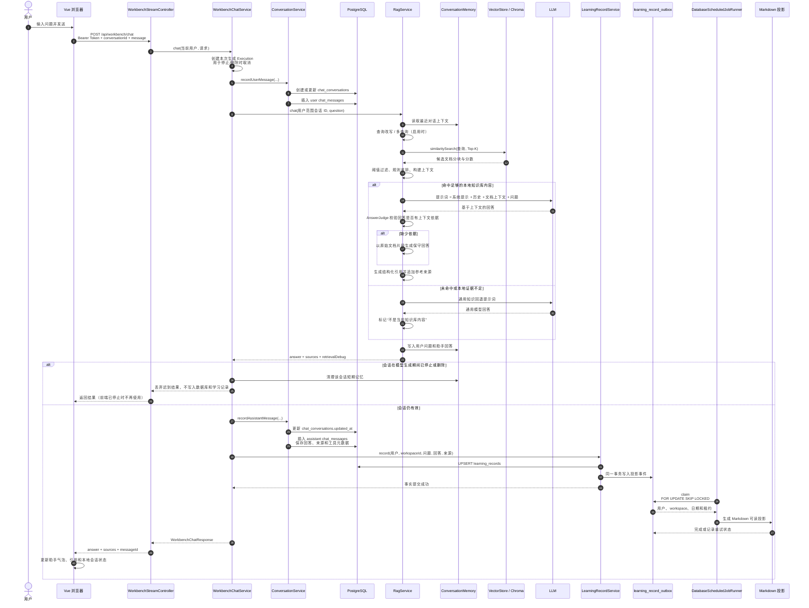

# 普通问答数据流

本文描述前端通过普通 `POST /api/workbench/chat` 发起一次问答时，消息、知识库检索、聊天历史和学习记录的完整流转。

## 关键边界

1. 用户消息先于模型调用保存，因此模型异常时问题仍可出现在聊天历史中。
2. RAG 回答优先使用本地知识库；无本地来源或资料不足时，才使用通用模型回退，并明确标记来源边界。
3. `ConversationExecutionRegistry` 防止停止或删除会话后，模型迟到结果重新写入 PostgreSQL。
4. 学习记录只在助手消息成功持久化后创建，因此被取消或删除的对话不会沉淀为知识。
5. `learning_records` 是学习记录事实源；普通问答成功写入后只保存结构化记录和 Outbox，不在请求线程中写文件或同步重建索引。
6. 学习记录投影 worker 按用户、workspace、日期生成 Markdown。文件是可读导出物，可以在事实表存在时删除后重建，不是权限或业务状态来源。
7. 正式笔记提升先写入 `formal_notes` 和 `formal_note_outbox`。正式笔记 worker 再生成 Markdown，并通过显式 owner/workspace 元数据更新文档索引、分块和向量库；投影失败不会撤销已提交的正式笔记。
8. 旧学习记录导入为 `LEGACY`，保留空 workspace。向量检索的用户和 workspace 过滤必须使用索引元数据和查询条件，不能仅将目录结构视为完整的数据访问隔离。

## 关键数据落点

| 数据 | 存储位置 | 用途 |
| --- | --- | --- |
| 用户与会话 | PostgreSQL `app_users`、`chat_conversations` | 身份与会话列表 |
| 聊天消息 | PostgreSQL `chat_messages` | 恢复历史消息、来源和工具事件 |
| 短期对话上下文 | `ConversationMemory` | 为当前 RAG 请求补充最近上下文 |
| 原始知识文档 | `docs/` | 可重新索引的知识源 |
| 学习记录事实 | PostgreSQL `learning_records` | 普通问答、Teaching 讲解、CHECK、PRACTICE 和历史导入记录 |
| 学习记录事件 | PostgreSQL `learning_record_outbox` | Markdown 投影的租约、重试和完成状态 |
| 每日学习记录投影 | `docs/learning-records/user-<id>/<workspace>/YYYY-MM-DD.md` | 可读导出物，不是事实源 |
| 正式笔记事实 | PostgreSQL `formal_notes` | 用户或 workspace 的整理笔记正文、哈希和索引状态 |
| 正式笔记事件 | PostgreSQL `formal_note_outbox` | Markdown、文档索引、分块和向量投影事件 |
| 正式笔记投影 | `docs/manual-notes/user-<id>/<workspace>/YYYY-MM-DD-learning-note.md` | 可重建文件投影 |
| 文档索引 | `DocumentIndexStore` | 文件路径、内容哈希、分块数等索引元数据 |
| 文档向量 | Chroma / `VectorStore` | 相似度召回 |
