# 普通问答数据流

本文描述前端通过普通 `POST /api/workbench/chat` 发起一次问答时，消息、知识库检索、聊天历史和学习记录的完整流转。

```mermaid
sequenceDiagram
    autonumber
    actor User as 用户
    participant Browser as Vue 浏览器
    participant API as WorkbenchStreamController
    participant Chat as WorkbenchChatService
    participant Conversation as ConversationService
    participant DB as PostgreSQL
    participant RAG as RagService
    participant Memory as ConversationMemory
    participant Vector as VectorStore / Chroma
    participant Model as LLM
    participant Learning as LearningRecordService
    participant Docs as docs/learning-records
    participant Ingest as DocumentIngestionService
    participant Index as 文档索引与向量库

    User->>Browser: 输入问题并发送
    Browser->>API: POST /api/workbench/chat<br/>Bearer Token + conversationId + message
    API->>Chat: chat(当前用户, 请求)
    Chat->>Chat: 创建本次生成 Execution<br/>用于停止/删除时取消

    Chat->>Conversation: recordUserMessage(...)
    Conversation->>DB: 创建或更新 chat_conversations
    Conversation->>DB: 插入 user chat_messages

    Chat->>RAG: chat(用户范围会话 ID, question)
    RAG->>Memory: 读取最近对话上下文
    RAG->>RAG: 查询改写 / 多查询（启用时）
    RAG->>Vector: similaritySearch(查询, Top-K)
    Vector-->>RAG: 候选文档分块与分数
    RAG->>RAG: 阈值过滤、规则重排、构建上下文

    alt 命中足够的本地知识库内容
        RAG->>Model: 提示词 = 系统提示 + 历史 + 文档上下文 + 问题
        Model-->>RAG: 基于上下文的回答
        RAG->>RAG: AnswerJudge 校验回答是否有上下文依据
        alt 缺少依据
            RAG->>RAG: 以原始文档片段生成保守回答
        end
        RAG->>RAG: 生成结构化引用并追加参考来源
    else 未命中或本地证据不足
        RAG->>Model: 通用知识回退提示词
        Model-->>RAG: 通用模型回答
        RAG->>RAG: 标记“不是当前知识库内容”
    end

    RAG->>Memory: 写入用户问题和助手回答
    RAG-->>Chat: answer + sources + retrievalDebug

    alt 会话在模型生成期间已停止或删除
        Chat->>Memory: 清理该会话短期记忆
        Chat-->>API: 丢弃迟到结果，不写入数据库和学习记录
        API-->>Browser: 返回结果（前端已停止时不再使用）
    else 会话仍有效
        Chat->>Conversation: recordAssistantMessage(...)
        Conversation->>DB: 更新 chat_conversations.updated_at
        Conversation->>DB: 插入 assistant chat_messages<br/>保存回答、来源和工具元数据

        Chat->>Learning: record(用户, workspaceId, 问题, 回答, 来源)
        Learning->>Docs: 追加至 docs/learning-records/<br/>user-<id>/YYYY-MM-DD.md
        Learning->>Learning: 基于问题和回答哈希去重
        Learning->>Ingest: ingestDocument(当天文件, force=true)
        Ingest->>Index: 删除该文件旧分块并写入最新分块
        Index-->>Ingest: 更新文档索引与向量数据

        Chat-->>API: WorkbenchChatResponse
        API-->>Browser: answer + sources + messageId
        Browser->>Browser: 更新助手气泡、引用和本地会话状态
    end
```

## 关键边界

1. 用户消息先于模型调用保存，因此模型异常时问题仍可出现在聊天历史中。
2. RAG 回答优先使用本地知识库；无本地来源或资料不足时，才使用通用模型回退，并明确标记来源边界。
3. `ConversationExecutionRegistry` 防止停止或删除会话后，模型迟到结果重新写入 PostgreSQL。
4. 学习记录只在助手消息成功持久化后创建，因此被取消或删除的对话不会沉淀为知识。
5. 每日学习记录按用户、日期聚合为单个 Markdown 文件；每个问答条目带有 `workspaceId`，列表、详情、编辑、删除和正式笔记提升都按 workspace 过滤。写入后仅重新索引该文件，而不是重建整个知识库。
6. 正式笔记按 `docs/manual-notes/user-<id>/workspace-<encoded-workspace-id>/YYYY-MM-DD-learning-note.md` 分目录保存，并以当前 workspace 的文档路径重新索引。
7. 旧学习记录没有 workspace 标记时不会被自动归属到指定空间；向量检索的用户和 workspace 过滤仍需以索引元数据和查询条件为准，不能仅将目录结构视为完整的数据访问隔离。

## 关键数据落点

| 数据 | 存储位置 | 用途 |
| --- | --- | --- |
| 用户与会话 | PostgreSQL `app_users`、`chat_conversations` | 身份与会话列表 |
| 聊天消息 | PostgreSQL `chat_messages` | 恢复历史消息、来源和工具事件 |
| 短期对话上下文 | `ConversationMemory` | 为当前 RAG 请求补充最近上下文 |
| 原始知识文档 | `docs/` | 可重新索引的知识源 |
| 每日学习记录 | `docs/learning-records/user-<id>/YYYY-MM-DD.md` | 按条目保存 workspace 标记的自动问答记录 |
| 正式笔记 | `docs/manual-notes/user-<id>/workspace-<encoded-workspace-id>/YYYY-MM-DD-learning-note.md` | 当前 workspace 的整理笔记 |
| 文档索引 | `DocumentIndexStore` | 文件路径、内容哈希、分块数等索引元数据 |
| 文档向量 | Chroma / `VectorStore` | 相似度召回 |
